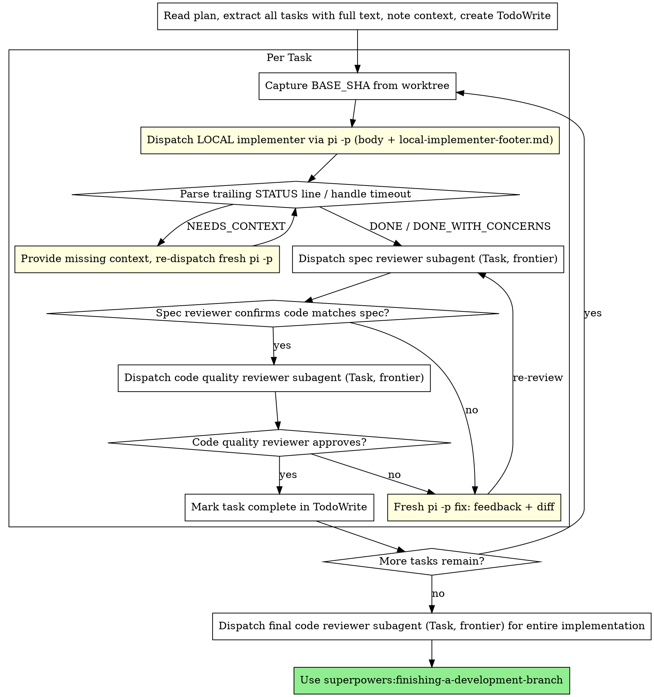

# Local-Subagent-Driven Development

A variant of **superpowers:subagent-driven-development**. Identical orchestration and identical
two-stage review — **the only change is who writes the code.** The implementer runs as a local
headless `pi -p` process inside the task worktree (free, local tokens) instead of a frontier
Claude Task subagent. Planning, both reviewers, and finishing all stay on the frontier, exactly
as the base skill configures them.

If you have not read **superpowers:subagent-driven-development**, read it first — every principle
there (fresh context per task, spec-then-quality review, continuous execution, never parallel
implementers, never skip review loops) applies here unchanged. This document repeats only what
differs.

**Core principle:** Frontier brain (plan + two-stage review), local hands (implement) — the
typing is free, the judgment is not.

**Continuous execution:** Same as base — do not pause to check in between tasks. Stop only on a
BLOCKED you cannot resolve, genuine ambiguity, or all tasks complete.

## When to Use

Use this instead of base subagent-driven-development when **all** of these hold:
- You have a well-specified plan with mostly independent tasks (same precondition as base).
- A local `pi -p` model is configured and reachable (see Local Dispatch Protocol).
- You want implementation tokens off the frontier meter.

If the local model isn't available, or the tasks need frontier-level reasoning to *implement*
(not just to review), use base **superpowers:subagent-driven-development** instead.

## The Process

Identical to base, except the implementer (initial dispatch and every fix re-dispatch) is a
local `pi -p` call instead of a Task subagent. Both reviewers remain Task subagents.



## Local Dispatch Protocol

This is the one section with no equivalent in the base skill. It defines exactly how the
implementer (and its fixes) run locally.

### Building the prompt

1. **Read the unchanged upstream implementer body** from the installed base skill:
   `superpowers:subagent-driven-development/implementer-prompt.md`. Use the text *inside* its
   `prompt: |` block — the same body you would have put in a Task subagent. Fill in Task
   Description (full text from the plan), Context (scene-setting), and working directory exactly
   as the base template instructs. Do **not** copy or edit that file into this repo.
2. **Append this skill's footer**, `./local-implementer-footer.md`, verbatim. The footer
   reconciles the interactive base body with headless execution and defines the machine-parseable
   `STATUS:` contract.
3. Write the assembled prompt to a temp file and pass it to pi with `@file` (no arg/stdin size
   ceiling).

### Invoking

```bash
PROMPT=$(mktemp)
{ printf '%s\n\n' "$IMPLEMENTER_BODY_WITH_CONTEXT"; cat local-implementer-footer.md; } > "$PROMPT"

cd "$WORKTREE"
BASE_SHA=$(git rev-parse HEAD)                 # capture BEFORE the run, for the quality reviewer

timeout --signal=KILL "$BUDGET_SECONDS" \
  pi -p --model "$LOCAL_MODEL" --thinking medium @"$PROMPT" \
  > out.txt 2> err.txt
rc=$?

STATUS=$(grep -E '^STATUS:' out.txt | tail -1)
HEAD_SHA=$(git rev-parse HEAD)                  # capture AFTER, for the quality reviewer
```

- **`$LOCAL_MODEL`** — v1: `lmstudio/gemma-4-26b-a4b-it` (provider/id form; no `--provider`
  needed). Configured in `~/.pi/agent/models.json`.
- **`$BUDGET_SECONDS`** — a generous per-task wall-clock cap (start ~600s; tune per plan).
  `pi -p` has **no internal timeout**, so this wrapper is mandatory.
- **`--thinking medium`** — enough reasoning for mechanical implementation without the latency of
  `xhigh`. Tune per task difficulty.

### Reading the result (spike-hardened — see brief §11)

- **Normal exit (`rc == 0`):** branch on `$STATUS` per "Handling Implementer Status" below.
- **Timeout (`rc == 137` or `124`):** `pi -p` **buffers all stdout until exit**, so a killed run
  yields empty `out.txt` even if work landed. **Do not trust stdout.** Inspect git instead:
  `git -C "$WORKTREE" log --oneline "$BASE_SHA"..HEAD` and `git status`. If commits landed and
  the tree is clean, salvage as `DONE_WITH_CONCERNS` and send to review (the reviewer is the real
  gate). Otherwise treat as `BLOCKED` and re-dispatch once with a larger budget; if it times out
  again, escalate.
- **No `STATUS:` line on a clean exit:** treat as `DONE_WITH_CONCERNS` and proceed to review —
  let the spec reviewer catch any gap. (Observed reliable so far, but never block the loop on a
  missing line.)

### Fix loop — fresh session, never resume

When a reviewer finds issues, **re-dispatch a fresh `pi -p`** — do **not** reuse `--session-id`.
(Spike §11: resuming a pi session that already holds tool-call history with tools enabled hangs
hard.) Statelessness is the rule, not a fallback. Give the fresh run enough to fix without prior
chat memory:

- The original task description (same body).
- The reviewer's specific findings (verbatim, with file:line references).
- `git -C "$WORKTREE" diff "$BASE_SHA"..HEAD` so it sees exactly what was built.
- The same footer (it will read current files in the worktree directly).

After the fix run commits, advance `HEAD_SHA` and re-review. The cwd worktree guarantees commits
land on the task branch.

### Convergence guard

A weak local model may not converge. **Cap the fix↔review cycles per reviewer at 3.** On
exhaustion, **stop and escalate to the human** with the diff and the outstanding findings — do not
keep bouncing or ship unreviewed code. (Acceptance: an oversized task surfaces here rather than
silently shipping.)

## Model Selection

The base skill tiers models and reserves the cheap/fast slot for mechanical implementation. Here,
local Pi **is** that slot:

- **Implementation (all of it):** local `pi -p` on `$LOCAL_MODEL`. v1 uses a single local model;
  tiering across local models is a later concern.
- **Spec review, code-quality review, final review:** Task subagents on the **most capable
  available model**, unchanged from base. A weak model reviewing a weak model's code is the thin
  spot in the loop — keep review on the frontier.

If a task genuinely needs frontier-level reasoning to *implement* (not just review), it does not
belong in this skill — run that task under base subagent-driven-development.

## Handling Implementer Status

Same four statuses as base, with local nuances:

**DONE:** Proceed to spec compliance review.

**DONE_WITH_CONCERNS:** Read the concerns first. Correctness/scope concerns → address before
review; observations → note and proceed. (Also the salvage status for a timed-out run that
nonetheless committed.)

**NEEDS_CONTEXT:** The headless run could not ask mid-task, so it stopped and listed what it
needs. Provide the missing context and re-dispatch a **fresh** `pi -p` (not a resume). This is the
local stand-in for the base skill's interactive question round-trip.

**BLOCKED:** Assess the blocker:
1. Context problem → provide more context, re-dispatch fresh.
2. Needs more reasoning than the local model has → this task likely belongs under base
   subagent-driven-development (frontier implementer); escalate to the human to reassign.
3. Task too large → break into smaller pieces.
4. Plan itself is wrong → escalate to the human.

**Never** force an identical re-dispatch with nothing changed, and never silently ship a run you
couldn't verify.

## Prompt Templates

This skill **owns no copy** of the upstream templates and **edits none of them** — that keeps
upstream pulls conflict-free and the most-likely-to-improve files shared.

- **Implementer body:** read at runtime from
  `superpowers:subagent-driven-development/implementer-prompt.md`, then append
  `./local-implementer-footer.md` (this skill's only implementer-facing file).
- **Spec reviewer:** `superpowers:subagent-driven-development/spec-reviewer-prompt.md`, used as-is.
- **Code-quality reviewer:** `superpowers:subagent-driven-development/code-quality-reviewer-prompt.md`,
  used as-is — it calls `superpowers:requesting-code-review` with `BASE_SHA`/`HEAD_SHA`, which the
  Local Dispatch Protocol captures from the worktree.

## Red Flags

Everything in the base skill's Red Flags applies. **Additionally, never:**

- **Reuse `--session-id` to resume a pi implementer for a fix** — resume + tools hangs hard.
  Fixes are always fresh stateless runs.
- **Run `pi -p` without a `timeout` wrapper** — it hangs indefinitely on model eviction and on the
  resume bug, with no error and no output.
- **Trust `out.txt` after a timeout** — stdout is buffered and lost on kill; judge progress from
  git state in the worktree.
- **Route either reviewer to the local model** — review stays frontier.
- **Keep bouncing a non-converging fix loop past the cap** — escalate to the human instead.
- **Dispatch local implementers in parallel** — same as base, conflicts.

## Integration

**Required workflow skills (all unchanged from base):**
- **superpowers:subagent-driven-development** — the parent skill; read it first. This skill reads
  its prompt templates at runtime and inherits all its principles.
- **superpowers:using-git-worktrees** — isolated workspace; its path is the `pi -p` cwd.
- **superpowers:writing-plans** — creates the plan this skill executes.
- **superpowers:requesting-code-review** — review template the code-quality reviewer uses.
- **superpowers:finishing-a-development-branch** — complete development after all tasks.

**Local implementer uses:**
- **superpowers:test-driven-development** — the upstream implementer body already instructs TDD;
  it carries through to the local run.

**Prerequisite:** a configured, reachable `pi -p` local model (`~/.pi/agent/models.json`).
